# Value and Momentum in U.S. Equities

None of the work below is anything new and uses well-known and well-tested value and momentum factors - rather it is an educational project in developing cross-sectional quantitative equities strategies and portfolio optimisation.

The work below is entirely mine, reproducing the results of research papers I've read in the past. I do not guarantee the correctness of the data contained in src/data but provide it for the ability to run the notebooks.

## Research note

The work is informed by Asness, Moskowitz, and Pedersen, [*Value and Momentum Everywhere* (2013)](https://doi.org/10.1111/jofi.12021). The paper documents value and momentum premia across markets and finds that the two styles are negatively correlated. This repository applies the joint-style framework to a monthly U.S. equity universe; it is not a replication of the paper's multi-asset tests.

All signals are evaluated against subsequent one- and three-month returns using cross-sectional Spearman information coefficients (ICs). Signals are winsorised and rank-scaled each month. The long-short charts are equal-weighted top-decile minus bottom-decile portfolios.

### Signal residualisation

All regressions are cross-sectional OLS regressions run separately each month. For a value input $x_{i,t}$, first remove its sector mean:

$$
\tilde{x}_{i,t}=x_{i,t}-\text{mean}\left(x_t\mid\text{sector of }i\right).
$$

For each value input, the monthly control regression is

$$
\tilde{x}_{i,t}=\beta_{0,t}+\beta_{1,t}\,\mathrm{beta}_{i,t}+\beta_{2,t}\,\mathrm{size}_{i,t}+\beta_{3,t}\,\mathrm{volatility}_{i,t}+\varepsilon_{i,t}.
$$

The residual $\varepsilon_{i,t}$ is the controlled value signal. This regression is applied to EBITDA/EV, earnings/price, sales/price, and book/price.

Momentum is not sector-demeaned. Each momentum measure is controlled in the same way:

$$
m_{i,t}=\gamma_{0,t}+\gamma_{1,t}\,\mathrm{beta}_{i,t}+\gamma_{2,t}\,\mathrm{size}_{i,t}+\gamma_{3,t}\,\mathrm{volatility}_{i,t}+u_{i,t}.
$$

The composite is winsorised, rank-scaled, and normalised.

### Value

Value starts with EBITDA/EV, earnings/price, sales/price, and book/price. The final composite uses EBITDA/EV, earnings/price, and sales/price. Each input is demeaned within sector, residualised against beta, size, and volatility, then rank-scaled and normalised.

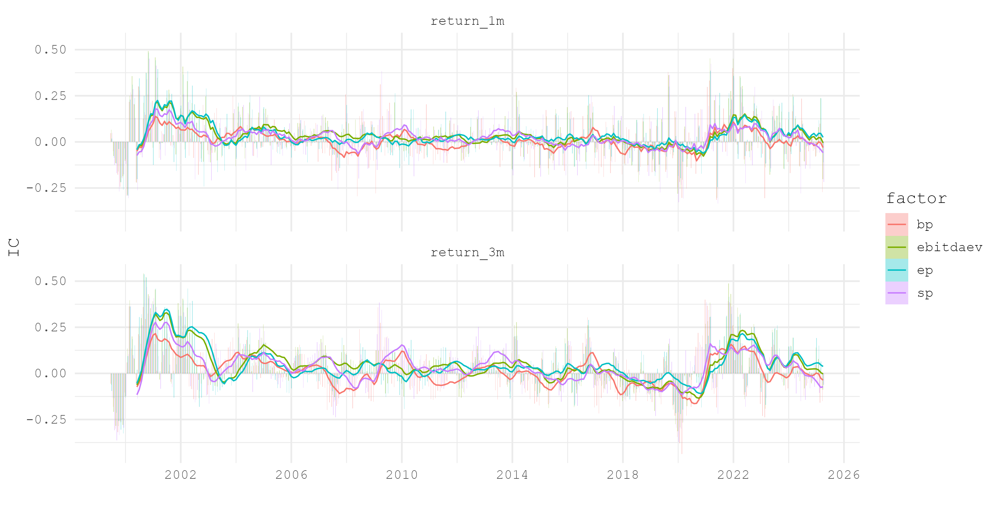

Figure 1 shows raw-factor ICs and 12-month averages for the one- and three-month horizons. The early sample and the 2021–22 period show the largest positive rolling readings; the series is weaker or negative in several intervening periods.

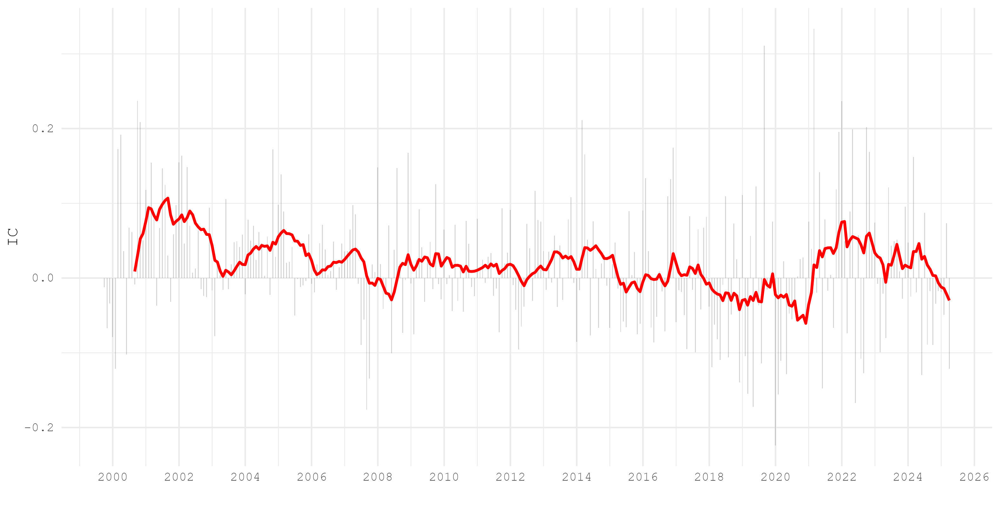

Figure 2 shows the one-month IC of the controlled value composite. The rolling IC varies materially through time, including weak readings from 2018 to 2020.

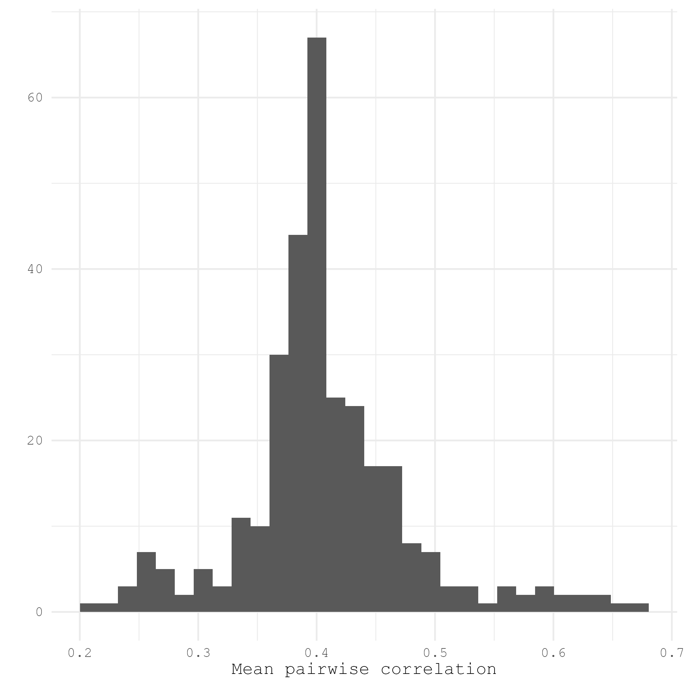

Figure 3 reports the distribution of monthly mean pairwise correlations among the raw value inputs. Most observations cluster around 0.4, so the inputs overlap but are not identical.

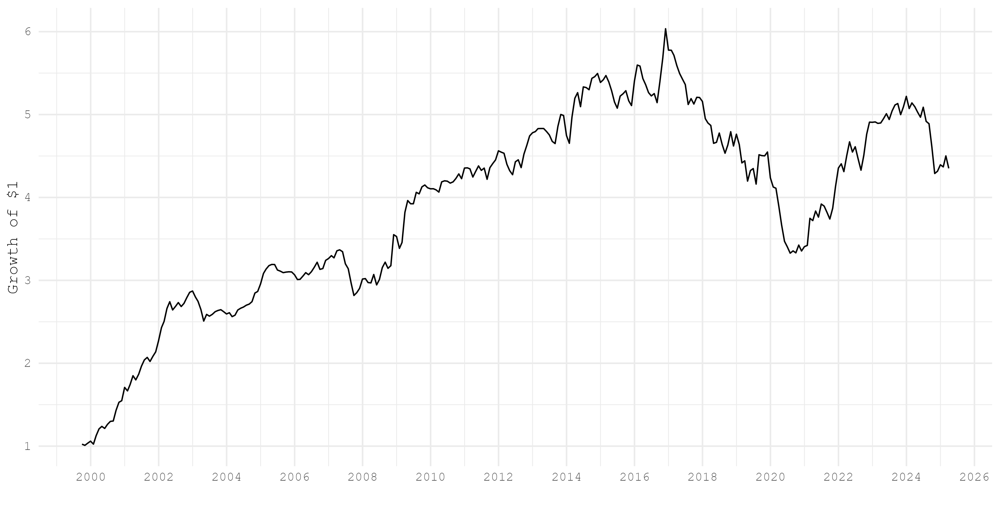

Figure 4 is the cumulative return of the value top-decile-minus-bottom-decile portfolio. The series has extended flat and drawdown periods before a strong rise from 2020.

### Momentum

Momentum is measured as six-month and twelve-month price return, each excluding the most recent month. The raw signals are winsorised and rank-scaled. The final inputs are residualised against beta, size, and volatility before they are averaged, rank-scaled, and normalised.

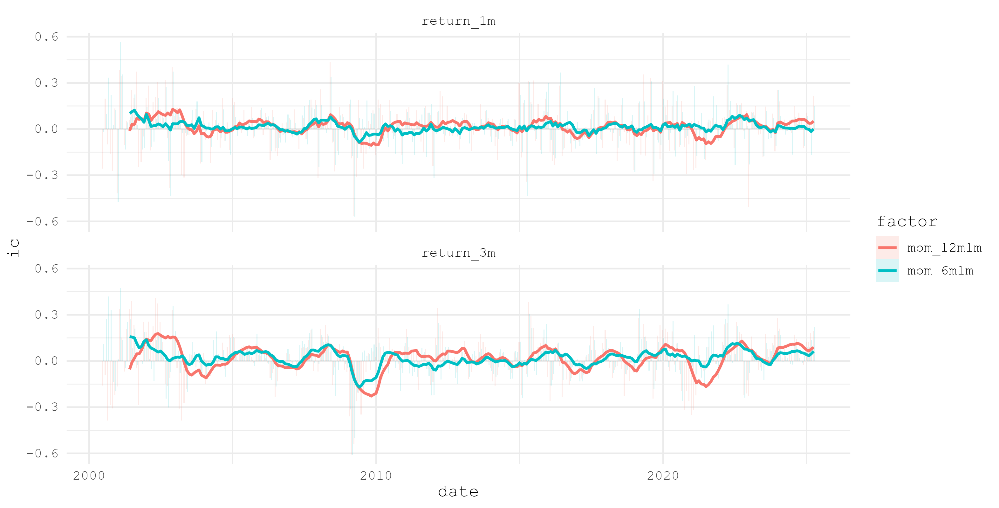

Figure 5 shows raw momentum ICs. Both lookbacks have positive and negative regimes, with the three-month horizon generally displaying larger swings.

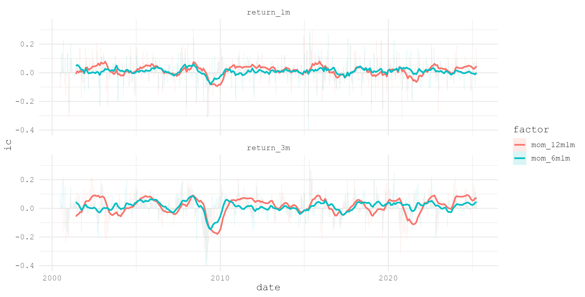

Figure 6 repeats the IC analysis after the control regressions. It isolates the momentum signal from the measured beta, size, and volatility exposures.

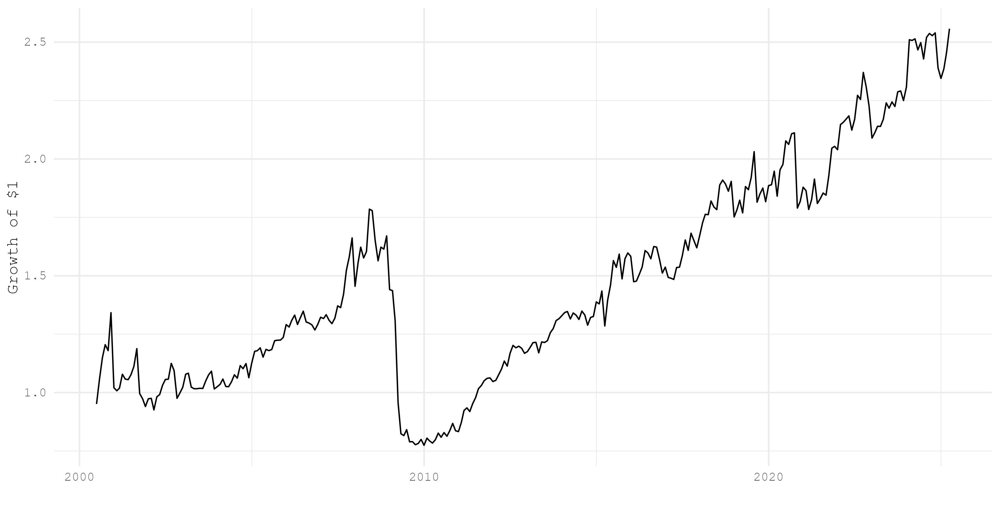

Figure 7 shows cumulative top-minus-bottom returns for the residualised momentum composite. The spread recovers after the 2009 drawdown and trends higher over the later sample, with meaningful variation along the way. The momentum drawdown in 2008/2009 is a well-known phenomena in the industry.

### Combined alpha and portfolio

The initial alpha is the equal-weighted value and momentum composite, using an available signal when the other is missing. Value is then residualised on momentum before forming the stored alpha, to reduce their overlap. The script reports little change in average IC from that adjustment.

At each monthly rebalance, the optimiser sets expected return to $\mu_i=0.02\,\alpha_i\,\mathrm{vol}_i/\sqrt{12}$ and solves

$$
\max_w\ \mu^\top w-\frac{\lambda}{2}\left(w^\top D w+(B^\top w)^\top F(B^\top w)\right)-\tau\lVert w-w^{-}\rVert_1.
$$

Here, $D$ is specific variance, $B$ is the exposure matrix to market, size, and value factors, $F$ is their covariance matrix estimated from the preceding three months of daily data, $w^{-}$ is the previous portfolio, $\lambda=25$, and $\tau=0.005$. The portfolio is fully invested, targets beta one after accounting for fixed securities, keeps each optimised holding within 15 bps of its benchmark weight, and leaves securities without a valid risk estimate at benchmark weight.

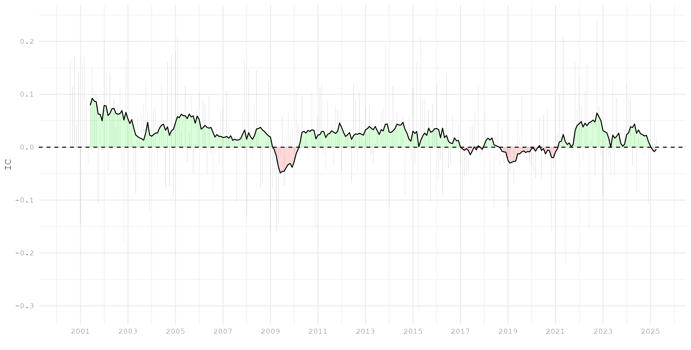

Figure 8 shows the one-month IC of the combined alpha and its 12-month average. The rolling IC is positive for much of the sample, with negative intervals around 2009 and 2018–20, with the latter being known as the "Quant Winter". Many real institutional quant funds experienced significant active return drawdowns during this period.

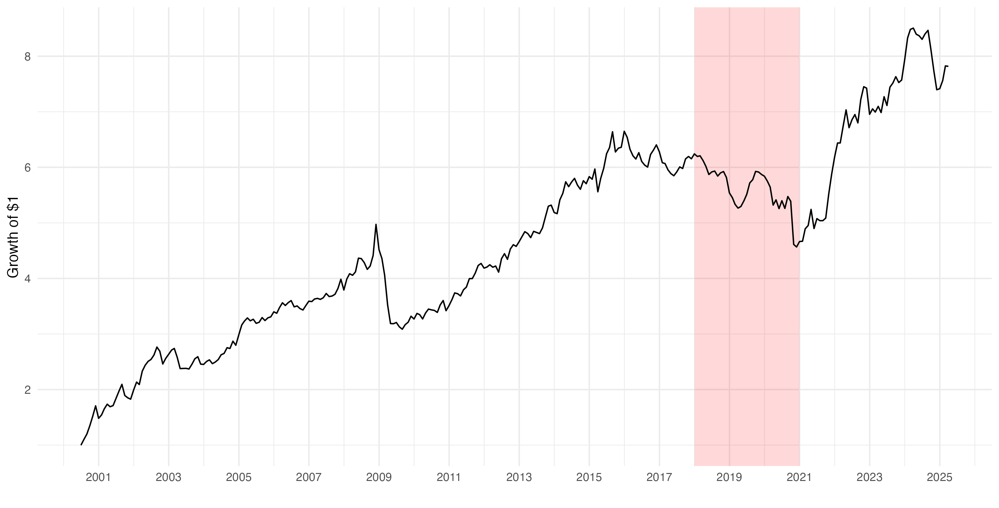

Figure 9 shows the cumulative top-minus-bottom return for the initial combined alpha. The shaded 2018–20 interval marks a period of drawdown and recovery in the strategy.

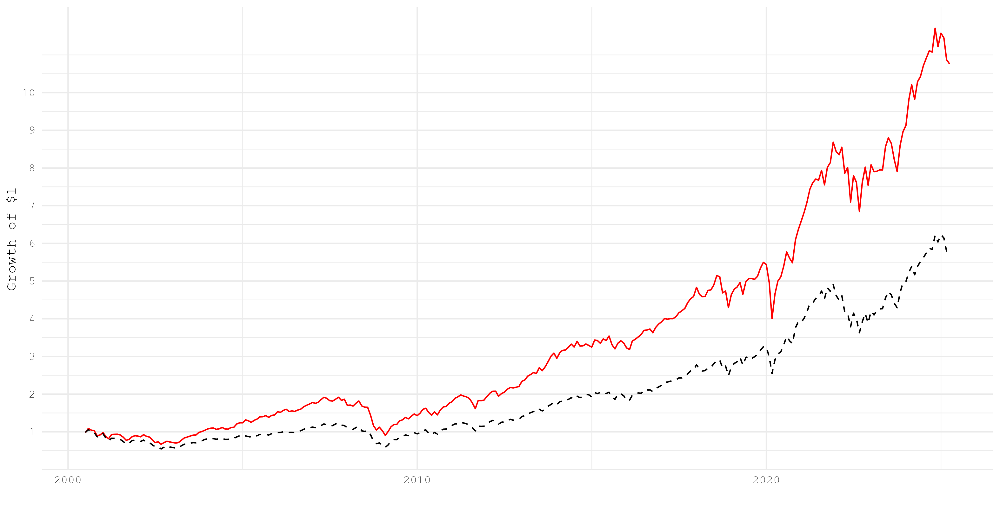

Figure 10 compares growth of $1 in the optimised portfolio with the benchmark. The optimiser converts alpha into expected return using stock volatility, uses a three-factor covariance model (market, size, and value), targets benchmark beta and total weight, caps active stock weights at 15 bps, and penalises turnover. Parameters into the optimisation were fine-tuned manually but were not grid searched.

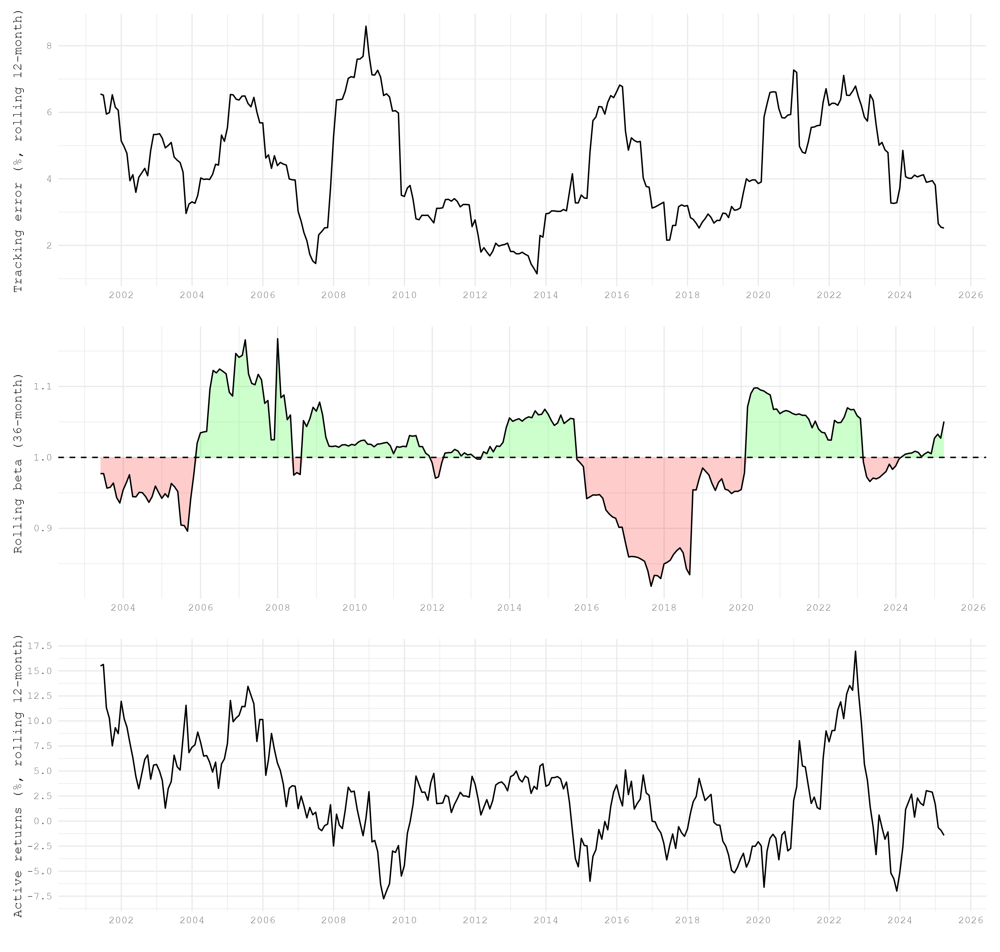

Figure 11 reports rolling tracking error, 36-month beta, 12-month active return, and one-way turnover. Tracking error and turnover rise in the later sample; beta stays close to, but does not remain exactly at, one.

The results are gross of transaction costs and are intended as research diagnostics, not investable performance estimates.
